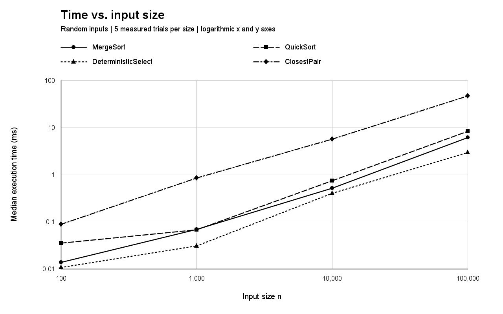
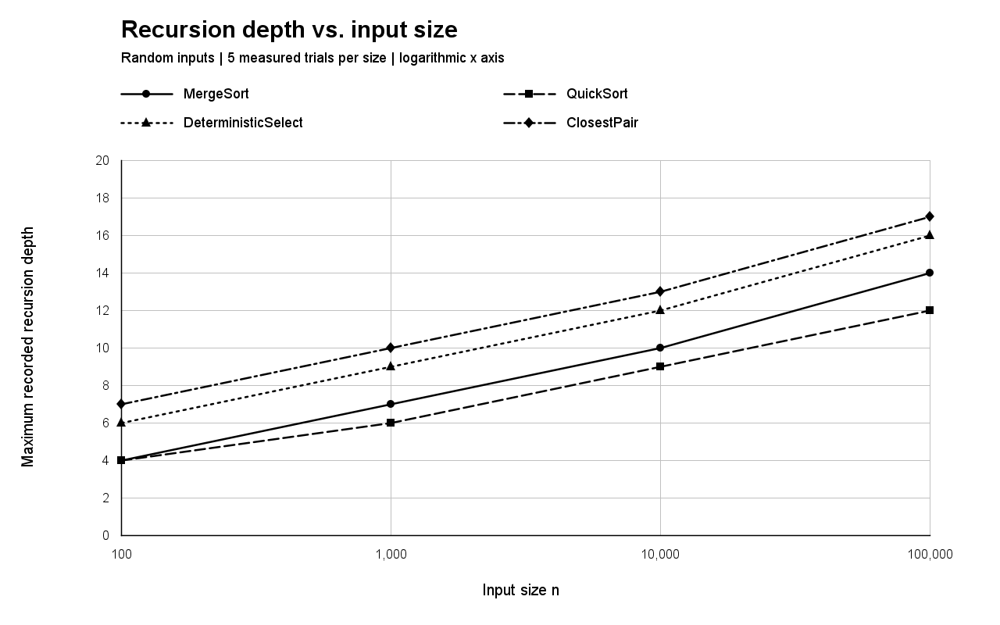
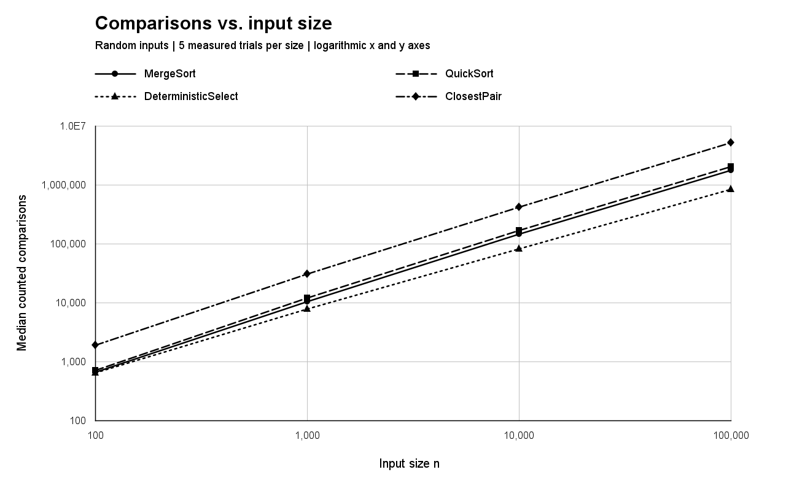
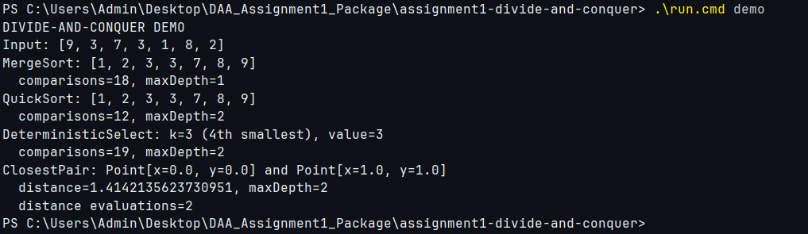
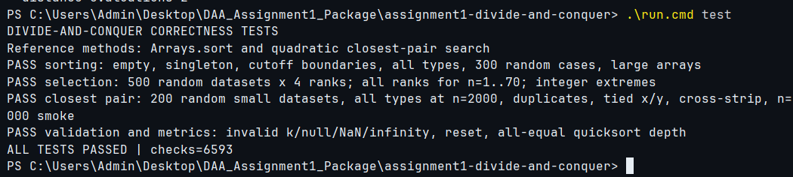

# Assignment 1: Divide-and-Conquer Algorithm Analysis

Java implementations, correctness checks, measurements, and a report for the course assignment.


## A. Project overview

The purpose is to implement four divide-and-conquer algorithms and compare their theoretical behavior with instrumented runs. The project contains MergeSort, randomized QuickSort, deterministic selection using median-of-medians, and a closest-pair solver for planar points. They solve different problems: the charts compare growth, not interchangeable functionality.

### Run

JDK 17 or newer is required. The command-line path has no external dependencies.
Run commands from the folder containing this README, not its parent.

Windows PowerShell:

```powershell
.\run.cmd all
```

Linux/macOS:

```sh
sh run.sh all
```

`all` compiles the code, runs the tests, shows a demonstration, runs experiments, generates three PNG plots, and updates the result tables in this README. Individual commands are `test`, `demo`, `experiments`, and `report`.

```powershell
.\run.cmd test
.\run.cmd demo
.\run.cmd experiments
.\run.cmd report
```

Alternatively, with Maven installed:

```sh
mvn test
mvn compile exec:java -Dexec.mainClass=Main -Dexec.args=all
```

Tests use a dependency-free main method with explicit checks that throw `AssertionError` on failure. The Maven `test` phase runs that method through the Exec plugin; JUnit is not used or required. Do not rely on the default Surefire count alone: look for `ALL TESTS PASSED` from `AllTests`.

### Structure

```text
assignment1-divide-and-conquer/
  src/
    MergeSorter.java
    QuickSorter.java
    DeterministicSelector.java
    ClosestPairSolver.java
    Point.java
    Metrics.java
    ArraySupport.java
    InputFactory.java
    Experiment.java
    ReportWriter.java
    PlotWriter.java
    Main.java
  tests/AllTests.java
  docs/
    screenshots/
    plots/
  results/
    results.csv
    summary.md
    environment.md
    test-output.txt
    demo-output.txt
    experiment-output.txt
  README.md
  pom.xml
  .gitignore
  run.cmd
  run.sh
```

## B. Algorithm analysis

`n` is the number of integers or points. Auxiliary space excludes the caller's input. The following recurrences analyze the implemented algorithmic work; rounded subproblem sizes do not change the asymptotic bounds. The assignment is the source of the required algorithms and features [1].

| Algorithm | Time | Auxiliary space | Recursive depth |
|---|---|---|---|
| MergeSort | Θ(n log n) for sufficiently large n | O(n) buffer plus O(log n) stack | O(log n) |
| Randomized QuickSort | Expected O(n log n); worst Θ(n²) | O(log n) stack; partition in place | O(log n), even for bad pivots |
| Deterministic Select | Worst-case Θ(n) | O(log n) stack; partition in place | O(log n) |
| Closest Pair | Θ(n log n) | O(n) working storage plus O(log n) stack | O(log n) |

### MergeSort

Split a range into halves, sort both halves, and merge them in linear time. A single auxiliary array is allocated per top-level call and reused by every merge. Ranges of at most 24 elements use insertion sort. Equal keys are taken from the left half first, preserving stability.

For n > 24, `T(n) = 2T(n/2) + Θ(n)`. In the Master Theorem, `a = 2`, `b = 2`, and `f(n) = Θ(n) = Θ(n^(log_b a))`. Case 2 gives `Θ(n log n)`. The fixed cutoff changes constants, not the asymptotic result. Even presorted halves are merged: there is no extra whole-range early-exit optimization in this implementation.

### Randomized QuickSort

Choose a uniformly random element of the current range as pivot. Three-way in-place partitioning creates `< pivot`, `== pivot`, and `> pivot` regions. The equal region needs no further work. Recursively process only the smaller outer region; update the bounds in a loop for the larger one.

For distinct keys, an expected-time recurrence is `E[T(n)] = (2/n) Σ(j=0..n−1) E[T(j)] + Θ(n)`, yielding `Θ(n log n)`. The ideal balanced recurrence `2T(n/2) + Θ(n)` also gives `Θ(n log n)` by Master case 2, but it is not a proof that every randomized partition is balanced. In the worst case, `T(n) = T(n−1) + Θ(n) = Θ(n²)`.

Every actual recursive child has at most half as many elements as its parent. Thus `D(n) ≤ 1 + D(floor(n/2)) = O(log n)`. Processing the larger part by a loop does not create a new frame. This saves stack space; it does **not** remove quadratic worst-case time. All-equal input is processed in one partition pass by this three-way version.

### Deterministic Select: median-of-medians

The public method returns the value at **zero-based** sorted rank k and may reorder the input. For example, k = 0 means the smallest value. Divide the current range into groups of five, insertion-sort each group, and move its median into a prefix of the same array. Recursively select the middle value of that prefix as pivot. Partition in place and recurse only into the outer region containing k. If k lies in the equal region, return the pivot.

Sorting a group of at most five costs O(1), so forming the medians costs O(n). Approximately half of the group medians are on each side of the pivot. Each full qualifying group contributes at least three elements on that side. Ignoring a constant number of exceptional elements, at least 3n/10 elements are eliminated. Therefore:

`T(n) ≤ T(ceil(n/5)) + T(7n/10 + O(1)) + O(n)`.

The ordinary Master Theorem does not directly apply to unequal subproblem fractions. Using Akra–Bazzi intuition, the corresponding upper-bound recurrence has `p` satisfying `(1/5)^p + (7/10)^p = 1`. At p = 1 the sum is 0.9, so p < 1. With linear nonrecursive work, the Akra–Bazzi expression is `Θ(n^p (1 + ∫₁ⁿ u^(−p) du)) = Θ(n)`. Equivalently, the total active sizes shrink by a factor about 0.9 per recursion-tree level, giving a convergent geometric sum of linear work. The top-level scan also needs Ω(n), so the worst-case bound is Θ(n).

The pivot-selection recursion is included in both the time recurrence and the measured depth. “Recurse only into the required partition” refers to the two outer regions after partitioning; choosing the pivot is a separate recursive subproblem.

### Closest Pair of Points

Sort a copy of the input by x, split by index, and solve both halves. Let d be the smaller within-half distance. A better crossing pair must be in the vertical strip of width 2d. Merge the two returned y-ordered halves in linear time, build the y-ordered strip, and check at most the next seven neighbors for each point. A y-gap of at least d ends that point's scan. The geometric constant-neighbor bound is the standard closest-pair packing argument [2].

Each recursive range is x-ordered when entered and y-ordered when returned. The split x-coordinate is saved **before** the recursive calls. The merge buffer is reused for strip storage after merging. Splitting by index handles tied x-coordinates without losing or duplicating points.

After the initial sort, `T(n) = 2T(n/2) + Θ(n)`. Master case 2 gives Θ(n log n); adding the initial O(n log n) sort preserves the bound. Sorting a strip from scratch at every recursive level could instead introduce O(n log² n) work, which this implementation avoids.

Fewer than two points return no pair and positive infinity. Duplicate points have distance zero. NaN and infinite coordinates are rejected; ordinary finite double coordinates are supported, subject to floating-point precision and representable-distance limits. The caller's point array is not reordered.

## C. Experimental results

### Method

Each algorithm is measured at n = 100, 1,000, 10,000, and 100,000, on random, sorted, reverse-sorted, and duplicate-heavy inputs. Three warmup runs per scenario are discarded; five measured trials remain. There are 320 raw CSV rows and 64 scenario summaries. Seeds are recorded; random/sorted/reverse inputs for a given n and trial have the same underlying data, merely reordered. Algorithm order is rotated between trials.

Integers use `Random.nextInt()`; duplicate-heavy integers have eight possible values. Random points are uniform in a 100,000 by 100,000 square; duplicate-heavy points use an 8 by 8 grid. Point sorting/reversing refers to x order, with y as a tie-breaker. Selection experiments request k = floor(n/2), while the tests exercise many different ranks.

Elapsed time is `System.nanoTime() − start` [3]. Input generation, external input cloning, reference answers, correctness checks, CSV writing, and plotting are outside the timed section. Intrinsic algorithm costs are inside: MergeSort's buffer allocation, QuickSort's pivot generator, and Closest Pair's internal copy, x-sort, and working buffer. These are **instrumented single-JVM experiments**, not production-quality microbenchmarks.

The table reports median time, maximum depth across the five trials, and median comparisons. Raw rows also include swaps, recursive calls, and distance evaluations. Integer comparisons count three-way key comparator invocations; point comparisons count coordinate/distance comparisons. Loop-index and boundary checks are not counted. Swaps count exchanges between different array indices, not assignments or insertion-sort shifts. Counts describe each implementation and are not equivalent work across different problems.

Depth means nested algorithm-recursion frames: the initial frame is 1, and no recursive call is 0. Iterating through QuickSort's larger region does not increase depth. Selector pivot recursion is counted. Nonrecursive helpers and internal `Arrays.sort` frames are excluded. Metrics reset before each public algorithm call.

<!-- RESULTS_START -->
### Random inputs: all tested sizes

| Algorithm | Input | n | Median ms | Max depth | Median comparisons |
|---|---|---:|---:|---:|---:|
| ClosestPair | random | 100 | 0.088700 | 7 | 1873 |
| ClosestPair | random | 1000 | 0.855300 | 10 | 30483 |
| ClosestPair | random | 10000 | 5.699900 | 13 | 413979 |
| ClosestPair | random | 100000 | 46.658900 | 17 | 5204619 |
| DeterministicSelect | random | 100 | 0.010600 | 6 | 641 |
| DeterministicSelect | random | 1000 | 0.030500 | 9 | 7702 |
| DeterministicSelect | random | 10000 | 0.402200 | 12 | 81840 |
| DeterministicSelect | random | 100000 | 2.946300 | 16 | 832945 |
| MergeSort | random | 100 | 0.013700 | 4 | 651 |
| MergeSort | random | 1000 | 0.069200 | 7 | 10348 |
| MergeSort | random | 10000 | 0.512100 | 10 | 143492 |
| MergeSort | random | 100000 | 6.099500 | 14 | 1764910 |
| QuickSort | random | 100 | 0.034900 | 4 | 707 |
| QuickSort | random | 1000 | 0.067900 | 6 | 11848 |
| QuickSort | random | 10000 | 0.741700 | 9 | 165711 |
| QuickSort | random | 100000 | 8.336600 | 12 | 2036448 |

### Input-structure comparison: n = 100,000

| Algorithm | Input | n | Median ms | Max depth | Median comparisons |
|---|---|---:|---:|---:|---:|
| ClosestPair | duplicates | 100000 | 36.727600 | 17 | 4992547 |
| ClosestPair | random | 100000 | 46.658900 | 17 | 5204619 |
| ClosestPair | reverse | 100000 | 23.561600 | 17 | 3769812 |
| ClosestPair | sorted | 100000 | 23.240000 | 17 | 3769812 |
| DeterministicSelect | duplicates | 100000 | 1.268200 | 9 | 308092 |
| DeterministicSelect | random | 100000 | 2.946300 | 16 | 832945 |
| DeterministicSelect | reverse | 100000 | 1.484900 | 16 | 851693 |
| DeterministicSelect | sorted | 100000 | 1.085600 | 16 | 597926 |
| MergeSort | duplicates | 100000 | 3.291800 | 14 | 1644608 |
| MergeSort | random | 100000 | 6.099500 | 14 | 1764910 |
| MergeSort | reverse | 100000 | 2.604700 | 14 | 1525616 |
| MergeSort | sorted | 100000 | 1.475200 | 14 | 717616 |
| QuickSort | duplicates | 100000 | 1.036800 | 3 | 324696 |
| QuickSort | random | 100000 | 8.336600 | 12 | 2036448 |
| QuickSort | reverse | 100000 | 4.247300 | 11 | 2086971 |
| QuickSort | sorted | 100000 | 4.215200 | 11 | 2055346 |

All 64 size/type/algorithm summaries are in [results/summary.md](results/summary.md). Raw data: [results.csv](results/results.csv). Runtime: [environment.md](results/environment.md).
<!-- RESULTS_END -->

### Plots

These images are regenerated from the CSV, never from theoretical or fabricated timings. Both required plots use random inputs; the tables cover all input types. Logarithmic axes are labeled explicitly.







### Correctness tests

Sorting is compared with `Arrays.sort` for random, sorted, reverse, duplicate-heavy, empty, singleton, integer-extreme, cutoff-boundary, and large inputs. There are 300 additional randomized sorting cases. Selection is checked on 500 random datasets at four ranks each, plus every rank for short arrays. `Arrays.sort(a)[k]` in the handout is shorthand: Java's `Arrays.sort` returns void, so tests first sort a copy and then read `expected[k]`.

Closest Pair is compared with an independent quadratic enumeration of all unordered pairs for small inputs, including all four input types at n = 2,000. Further cases cover coincident points, tied x/y, a closest pair across the split, and empty/singleton arrays. The fast algorithm also has an n = 100,000 smoke test; this does not independently establish the large answer's optimality. Returned points, returned distance, and preservation of the input array are checked. Complete output is in `results/test-output.txt`.

## D. Discussion

**Do measurements match theory?** Compare the time and operation-count plots, rather than treating one small timing as proof. MergeSort and Closest Pair have fixed balanced recursion and slowly growing depth. The selector has a linear worst-case bound, while its constants include several group scans. Four input sizes and one JVM run are insufficient to establish an asymptotic law empirically. The supplied run shows startup noise in small cases; operation counts and the recurrence analysis are stronger evidence about algorithmic growth. Re-running the experiments can change which implementation is fastest at a particular size.

**How does input structure matter?** MergeSort's split tree is unchanged, but insertion-sort leaves and merge comparisons depend on input order. Random pivots prevent sorted input from systematically choosing a bad fixed pivot; duplicate-heavy input particularly benefits from three-way partitioning. Selection also skips equal-pivot values. Closest Pair initially sorts by x, so sorted and reversed order can affect preprocessing constants. Coincident points give zero distance and reduce useful strip work without removing all recursion and y-merges.

**Why smaller-first QuickSort?** Every nested recursive child is at most half the current size. The larger region remains in the current frame. The resulting O(log n) stack bound concerns memory, not worst-case total work.

**Why O(n) median-of-medians?** Groups of five guarantee that a constant fraction of values can be discarded, while computing the pivot takes a subproblem of about n/5. Their total worst-case fractions sum to less than one. The pivot need not be the exact median of the full array.

**Why is closest-pair divide-and-conquer better than quadratic search?** Brute force evaluates n(n−1)/2 pairs. The fast version recursively solves halves and uses geometry to keep strip work linear per level. For n = 100,000, exhaustive enumeration would require 4,999,950,000 pair evaluations; the program deliberately avoids that large reference run. Constant factors still matter on small datasets.

**What practical factors matter?** JVM just-in-time compilation, allocation, garbage collection, CPU/cache behavior, background tasks, timer resolution, and the counters themselves all affect measured time. Three warmups are a modest mitigation, not a guarantee that JIT compilation is finished. A nanosecond API does not promise nanosecond measurement accuracy [3]. For stronger evidence, use more warmups, independent JVM runs, repeated measurements, and normalized operation counts. Also, selection and closest-pair solve different tasks, so a faster plotted line does not make either a replacement for a sorting algorithm.

## E. Reflection
During this assignment, I learned how divide-and-conquer algorithms split a large problem into smaller parts and solve them recursively. I understood the main difference between MergeSort and QuickSort and also learned how recursion depth can affect performance.

The most difficult part for me was understanding Deterministic Select and Closest Pair because their recursive logic is more complex. Testing the algorithms on different input sizes helped me understand how their theoretical complexity is related to actual execution time.
## F. Screenshots

### Program Output



### Test Results



### Experimental Results


## References

[1] Course handout. *Assignment 1: Divide-and-Conquer Algorithm Analysis*, pp. 1–4. Requirements and grading rubric supplied with the assignment.

[2] Robert Sedgewick and Kevin Wayne. *Algorithms, 4th Edition*, companion material: [ClosestPair](https://algs4.cs.princeton.edu/code/edu/princeton/cs/algs4/ClosestPair.java.html). Consulted for the standard y-merge/strip organization and seven-neighbor geometric bound. The implementation in this project uses its own classes and instrumentation; the algs4 library is not a dependency.

[3] Oracle. [Java SE 17: System.nanoTime](https://docs.oracle.com/en/java/javase/17/docs/api/java.base/java/lang/System.html#nanoTime()). Elapsed-time semantics and precision caveat.

[4] Apache Maven. [Compiler release configuration](https://maven.apache.org/plugins/maven-compiler-plugin/examples/set-compiler-release.html). MojoHaus. [Exec plugin usage](https://www.mojohaus.org/exec-maven-plugin/usage.html).
